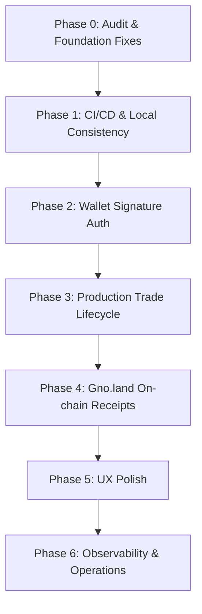

# Trade Window Production Roadmap

This roadmap details the phases and tasks required to transition the Trade Window platform from a research MVP to a secure, stable, and user-friendly production-grade product.



---

## Phase 0: Audit & Foundation (Completed)
* [x] **Audit Current State**: Detailed analysis of runtime, DB, UI, security, and flows (completed in [PRODUCT_READINESS_AUDIT.md](file:///Users/dmitriydintsen/ai-tools/trade/docs/PRODUCT_READINESS_AUDIT.md)).
* [x] **Idempotent Migration Runner**: Embedded SQL scripts via `go:embed` inside [migrations.go](file:///Users/dmitriydintsen/ai-tools/trade/services/backend-go/migrations/migrations.go) and wrote startup migration runner [migrations.go](file:///Users/dmitriydintsen/ai-tools/trade/services/backend-go/internal/storage/migrations.go).
* [x] **Deployment Smoke Script**: Created [production-smoke.sh](file:///Users/dmitriydintsen/ai-tools/trade/scripts/production-smoke.sh) to verify live endpoints.
* [x] **Privacy Guard Script**: Created [privacy-regression.sh](file:///Users/dmitriydintsen/ai-tools/trade/scripts/privacy-regression.sh) to prevent leaking emails or contacts.
* [x] **Mainnet Guard Script**: Created [mainnet-guard-regression.sh](file:///Users/dmitriydintsen/ai-tools/trade/scripts/mainnet-guard-regression.sh) to check mainnet block status.

---

## Phase 1: CI/CD & Environment Consistency (In Progress)
* [x] Enforce Go tests and lint checks in GitHub actions.
* [ ] standard dev container configuration (e.g. `.devcontainer/devcontainer.json`) or local Makefile with Docker commands so developers can run verification commands even if Go/Docker are missing locally.
* [ ] Align Railway build flow using nixpacks or the multi-stage Alpine Dockerfile.

---

## Phase 2: Wallet Signature Authentication (P0 Priority - Blocked/Pending)
Currently, client-side identity uses the `?wallet=` query parameter, which is spoofable. This parameter has been deprecated in production, and requests without active verified sessions are blocked. However, full signature verification is currently blocked (see [WALLET_AUTH_PLAN.md](file:///Users/dmitriydintsen/ai-tools/trade/docs/WALLET_AUTH_PLAN.md) for details).

### Authentication Flow
1. **Nonce Generation**: 
   * `POST /api/auth/nonce`
   * Backend generates, saves, and returns a secure, short-lived random nonce associated with the user's connection.
2. **Signature Request**:
   * Frontend requests the user sign a structured message via Adena:
     ```txt
     Domain: tradewindow.xyz
     Purpose: Authentication
     Nonce: <backend_nonce>
     Timestamp: <iso_timestamp>
     ```
3. **Verification & Session**:
   * `POST /api/auth/verify`
   * Backend verifies the signature against the nonce and wallet address.
   * On success, backend issues a secure JWT or HttpOnly session cookie.
4. **Endpoints Security**:
   * Secure `GET /api/me/trades` and `POST /api/deal-requests` to verify identity using the active session token instead of arbitrary query parameters.
   * `POST /api/auth/logout` clears the session.

---

## Phase 3: Real Trade Lifecycle (P1 Priority)
Transition trade room states from simple string flags to a strict, validated finite state machine.

### Lifecycle Status Model
* `draft`: Prepared listing/deal.
* `listed`: Published to the public board.
* `requested`: Counterparty submitted a deal request.
* `accepted`: Both parties joined the Trade Room.
* `previewed`: Transaction intent previewed.
* `committed`: Gno.land on-chain receipt hash recorded.
* `settled`: Final on-chain transaction completed (requires audit).
* `cancelled` / `expired`: Closed or invalidated.

### Implementation Checklist
- [ ] Backend status transition validations (e.g., cannot transition from `draft` straight to `committed`).
- [ ] Internal immutable audit trail table `trade_events` populated for every action.
- [ ] `GET /api/trade/rooms/:id/events` to fetch the room's event timeline.
- [ ] Frontend Trade Room timeline visualization.

---

## Phase 4: Gno.land On-chain Receipt/Commitment (P1 Priority)
Build a non-custodial cryptographic proof of deal terms.

### Key Fields for On-chain Commitments
* `tradeId` (UUID)
* `maker` & `counterparty_hash` (Privacy guard: hide taker's real identity)
* `assetIn` & `assetOut`
* `amountIn` & `amountOut`
* `termsHash` (SHA256 hash of canonical terms JSON)
* `metadataHash` (SHA256 hash of off-chain metadata)

### Privacy Controls
* Direct contact details (emails, phone numbers, handle text) must never be written on-chain.
* The frontend must display warnings explaining that Trade Window acts as a commitment receipt recorder, not a custodial escrow agent.

---

## Phase 5: UX Polish & Responsive Design (P1 Priority)
* [ ] Clear wallet state handling (connect modals, disconnected prompts).
- [ ] Empty states and skeletons for listings/history.
- [ ] History filters (All, Active, Needs Action, Completed, Cancelled).
- [ ] Mobile navigation and full responsiveness for table layouts.

---

## Phase 6: Observability & Operational Safety (P1 Priority)
- [ ] Structured JSON logs with request IDs (`Request-ID` middleware).
- [ ] Sanitization logic to strip secrets and DATABASE_URL from log payloads.
- [ ] DB daily export script to secure offsite cold storage.
