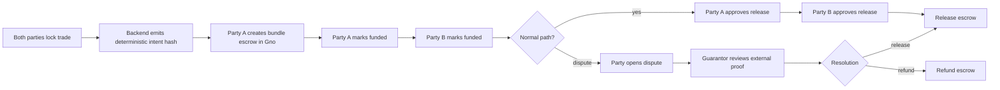

# Escrow Service Design

Status: local Gno prototype, not deployed to mainnet.

Trade Window escrow is designed as a non-custodial, intent-hash settlement layer. The live Go backend coordinates temporary room state; the Gno escrow realm records the settlement state for a finalized bundle intent.

## Current implementation

- Gno realm: `gno/realms/tradewindow/escrow`
- Frontend payload builder: `apps/web/src/lib/gno/escrow-call.ts`
- Backend readiness endpoint: `GET /api/gno/status`
- Trade room preview: `/trade` ready-to-sign panel
- Test runner: `scripts/gno/test-contracts.sh`

The current realm supports:

- `CreateVerifiedExchange` for simple one-asset-per-side exchange state
- `CreateBundleEscrow` by `partyA`
- bundle digest storage for both offer sides
- sender/receiver/fee storage for verified exchange assets
- fake verified token rejection by `chainId + technicalDenom`
- funding acknowledgements from both parties
- funding proof recording via `MarkFundedWithProof`
- dual-party release approval
- release only after both approvals
- dispute opening by either party
- guarantor release/refund resolution
- cancellation before both sides are funded

## Guarantor model

The guarantor is not allowed to change the offer or intent hash. The guarantor only resolves an already disputed escrow.

## Safety constraints

- Mainnet transfers remain disabled by default.
- The frontend shows a Gno `/vm.m_call` preview before signing.
- `NEXT_PUBLIC_ENABLE_ESCROW_TESTNET_SETTLEMENT=true` is required before the UI attempts Adena signing.
- Backend Gno wiring stays disabled unless `GNO_SETTLEMENT_ENABLED=true` and a local/testnet `GNO_RPC_URL` plus `GNO_ESCROW_REALM_PATH` are configured.
- The backend never holds private keys and is not a settlement authority.
- The escrow realm uses the deterministic intent hash as the bundle source of truth.
- Verified exchange assets are checked by technical identity, not only display ticker.
- NFT settlement is still preview/intent only until a supported transfer standard and deployment path are verified.

## Not yet production-ready

- No deployed Gno testnet/mainnet realm is configured in this repo.
- No production custody audit has been completed.
- No cross-chain atomic IBC execution is implemented.
- No guarantor evidence submission schema is implemented yet.
